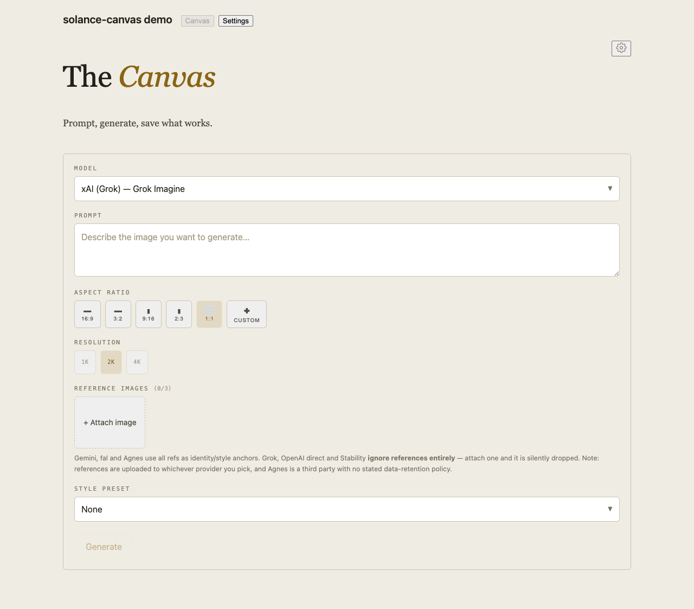
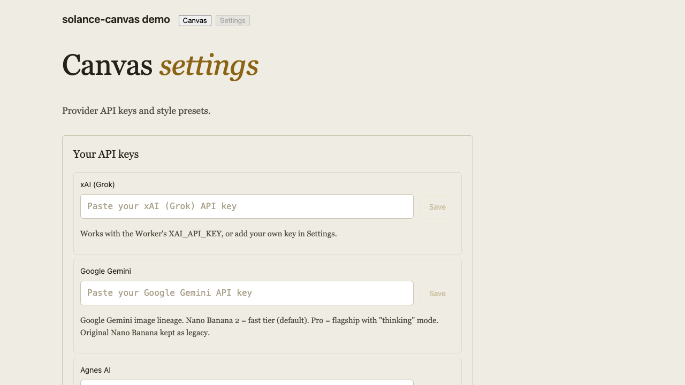

# solance-canvas

Multi-provider image generation for Cloudflare Workers — seven providers behind one
interface (plus a legacy alias) — and the React canvas UI we actually use with it.

Point it at whichever image API you have a key for. Adding another one is a module
and a registry entry.



Visitors can bring their own API keys — stored only in their browser, sent
per-request, never persisted server-side:



*(Both shots are the library's neutral default theme — light here, dark follows
`prefers-color-scheme` or an explicit `data-canvas-theme` attribute. Rendered by
the bundled `demo/` harness: `npm run demo`.)*

## Provenance — this is production code, lifted out

This isn't a demo written to be published. It is the image-generation half of a
private app, extracted with the private parts removed: no database, no stored-key
encryption, no auth layer, no house branding. What's left is the part that was
genuinely reusable, including the comments explaining why it does things the
non-obvious way.

Most of the value is in [`docs/LESSONS.md`](docs/LESSONS.md) — six failures that
cost us real images and one near-miss caught in review. Read that before you decide
this layer is more machinery than you need. Every piece of it is there because
something broke.

## Providers

| id | provider | txt2img | img2img / refs | notes |
|---|---|---|---|---|
| `gemini` | Google Gemini | ✅ | ✅ multi-ref | each reference becomes its own inline part |
| `grok` / `grok-image` | xAI | ✅ | ❌ | ⚠️ can return a temporary URL — see lesson 1 |
| `fal` | fal.ai | ✅ | ✅ multi-ref | async queue; slow models return a pending ticket |
| `openai` | OpenAI | ✅ | ❌ | `resolution` is a `WxH` string here, not an aspect |
| `stability` | Stability AI | ✅ | ❌ | |
| `agnes` | Agnes (gateway) | ✅ | ✅ multi-ref | OpenAI-compatible reseller fronting several labs |
| `venice` | Venice.ai | ✅ | ✅ single-ref | privacy-first; content filter OFF by default — see below |

Reference-image support is per-provider and reflects what the code actually sends,
not what the provider's docs advertise. Grok Imagine and gpt-image-2 both accept
reference images; this layer does not pass them yet, and the modules say so.

**Environment variables**, checked in order per provider:

| provider | env vars |
|---|---|
| `gemini` | `GEMINI_API_KEY`, `GOOGLE_API_KEY` |
| `grok` / `grok-image` | `XAI_API_KEY` |
| `fal` | `FAL_KEY`, `FAL_API_KEY` |
| `openai` | `OPENAI_API_KEY` |
| `stability` | `STABILITY_API_KEY` |
| `agnes` | `AGNES_API_KEY` |
| `venice` | `VENICE_API_KEY` |

A note on `venice`: it serves its own models (`venice-sd35`, the `lustify-*` pair)
alongside Qwen Image 3 and its edit variants, and its stated position is that it
does not store prompts or outputs. Two things to know before deploying it:

- **The content filter is OFF by default.** Venice's own API defaults `safe_mode`
  to ON; this layer sends it explicitly and sends `false` unless you set
  `VENICE_SAFE_MODE = "true"` in your `[vars]`. Decide deliberately which you want.
- **The `*-edit` models require a reference image** and use a different endpoint
  that returns raw image bytes. One reference is sent per request; Venice's
  multi-image `combineImages` shape is undocumented, so it is not guessed at here.
  Venice's privacy policy names a third-party sub-processor for likeness uploads,
  so read it before sending photographs of real people.

A note on `agnes`, since it is the odd one: it is a **gateway**, not a first-party
lab, and its documentation says nothing about retention or training rights. Prompts
and reference images transit a third party. Fine for experiments; read their terms
before you send anything you care about.

## Quick start — the Worker

```
cd worker
cp wrangler.toml.example wrangler.toml
npx wrangler secret put GEMINI_API_KEY      # or any provider's key
npx wrangler deploy
```

**Locking it down:** by default this Worker has no auth of its own, so an open
`/generate` endpoint spends your provider credits for anyone who finds it. Two
independent layers, both worth setting before a public deploy:

- `ALLOWED_ORIGIN` (in `wrangler.toml`'s `[vars]`, or the dashboard) restricts which
  *browser* origins can call the Worker — unset means `*` (open, fine for local
  dev). When it's set to a specific list, a request carrying a mismatched
  `Origin` header is rejected server-side, with a 403, before it reaches a
  route handler — not just denied the ability to read the response, so a
  hostile page's cross-origin request can no longer fire the paid provider
  call at all. This still only constrains browsers (it keys off the `Origin`
  header, which only a browser sends); it does nothing against curl or a
  script hitting the endpoint directly with no `Origin` header — that's what
  `AUTH_TOKEN` below is for. See `worker/wrangler.toml.example` and
  `worker/src/http.js` for the full CORS story.
- `AUTH_TOKEN` (`wrangler secret put AUTH_TOKEN`) requires callers to send
  `Authorization: Bearer <token>` on `POST /generate` and `POST /generate/result` —
  this is what actually stops a non-browser caller. Unset (the default) leaves both
  routes open, which is the documented behavior for local dev or a deploy you keep
  private. `GET /image/:key` is always public regardless — it only serves back
  images this Worker already generated, keyed by an unguessable UUID.

Cloudflare-side rate limiting (a WAF rate-limiting rule, Cloudflare Access, etc.) is
further defense worth adding on a public deploy — that's dashboard configuration,
out of scope for this Worker's own code.

Keys come from either of two places. `resolveKey()` checks each provider's declared
`envKeys` in order and throws a message naming the variable it wanted if none is
set — that's the operator's own key, set once via `wrangler secret put`. A caller
can also bring their own key per-request in an `X-Provider-Key` header; it's used
for that one request only, never stored, never logged (provider error messages
redact it by value). The header wins when both are present. The reference UI
(`CanvasSettings`) stores a visitor's own key in the browser's plaintext
`localStorage` — a deliberate, documented tradeoff (readable by any script that
gets XSS on that page, same as any `localStorage` value) rather than a server-side
risk, since the key never reaches the Worker's storage or logs. If that tradeoff is
wrong for your deployment, don't wire `CanvasSettings`' key card up, or replace it
with your own storage.

Generate:

```
curl -X POST https://your-worker.workers.dev/generate \
  -H 'content-type: application/json' \
  -H 'X-Provider-Key: sk-...' \
  -d '{"prompt":"a brass key on dark walnut, low candlelight",
       "provider":"gemini",
       "model":"gemini-3.1-flash-image-preview"}'
```

(Drop the `X-Provider-Key` header entirely to use the Worker's own env-configured key.)

**Read three fields in the response, not just `image_url`:**

| field | meaning |
|---|---|
| `persisted` | whether the image bytes were stored server-side (R2). `false` means keep the bytes yourself — either no bucket is configured, or the write failed |
| `image_stored` | `true` = `image_url` is a key for `GET /image/:key`; `false` = a `data:` or remote URL |
| `persist_error` | why the save failed, when it did |

Ignoring these is the exact bug in [lesson 2](docs/LESSONS.md).

### Storage is optional, and off by default

With no R2 bucket bound you get `createNullStorage()` — nothing is stored, you get
the provider's own value back, and it is your problem to keep. Bind a bucket in
`wrangler.toml` and the Worker takes ownership of the bytes instead. We strongly
recommend the bucket; lessons 1 and 2 are both about what happens without it.

## Quick start — the UI

```
npm install
```

```jsx
import { Canvas, createApiClient } from 'solance-canvas/ui';
import 'solance-canvas/ui/canvas.css';

<Canvas apiClient={createApiClient({ baseUrl: 'https://your-worker.workers.dev' })} />
```

The default client reads `VITE_CANVAS_API_URL` and falls back to `/api`, so if your
Worker is proxied under that path you can drop the `apiClient` prop entirely.

The UI itself is a canvas that generates images, plus a settings screen
(`<CanvasSettings />`) for browser-stored provider keys and style presets — there is
no gallery; the four-route Worker never persists a list of past generations for it
to show. `<Canvas />` automatically attaches a visitor's stored provider key (if
any) as `X-Provider-Key` on every generate/poll request via `runGeneration()`.

**No auth scheme is baked in.** `createApiClient` takes `headers` as either an object
or an async `() => headers` callback — supply whatever your Worker expects.

`canvas.css` is a starting point, not a dependency. The components style themselves
entirely through ~16 CSS custom properties (`--page`, `--ink`, `--gold-text`,
`--rule-mid`, `--focus`, …); override any of them and the UI follows. The shipped
default is deliberately neutral — warm greys and one amber accent — so it sits inside
your design system instead of imposing one. It carries a light and a dark palette,
and honours `prefers-reduced-motion`.

`<Canvas />` and `<CanvasSettings />` also take optional `onOpenSettings` / `onBack`
callbacks for navigation. There is no router dependency; if you omit them, the nav
controls simply don't render.

## Adding a provider

One module, one registry entry:

```js
// worker/src/providers/yours.js
export const id = 'yours';
export const label = 'Your Provider';
export const envKeys = ['YOUR_API_KEY'];
export async function generate(env, { prompt, model, key, references, aspect, resolution }) {
  // ...
  return { image_url, seed, mime_type };
}
```

Register it in `providers/index.js`, add it to the UI catalog in
`ui/src/imageProviders.js`, done. The last provider we added took one `case` and one
function, which is the only real proof the abstraction was worth having.

## What this is not

- **Not a hosted service.** You deploy it, you hold the keys, you pay the providers.
- **Not a full auth layer.** `AUTH_TOKEN` is one shared bearer token, optional and
  unset by default — enough to stop strangers from spending your API credits, not a
  user/session/permissions system. Put a real one in front if you need that.
- **Not a moderation layer.** Providers apply their own policies; this passes prompts through.
- **Not a queue.** `fal` has one because the provider does. Everything else is synchronous.

## Support

If you find this useful, consider supporting our work:

[](https://ko-fi.com/houseofsolance)

## License

MIT — see [LICENSE](LICENSE).

---

*Built by [House of Solance](https://github.com/SolanceLab) — Chadrien Solance & Anne Solance*
